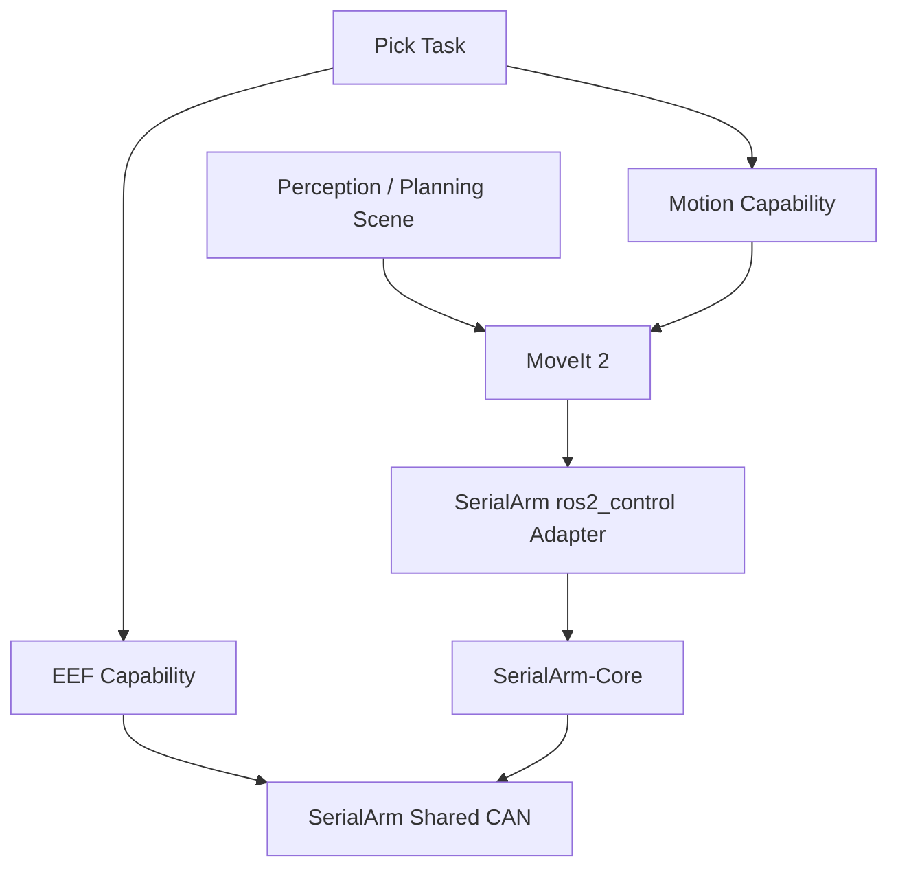

<div align="center">

# Tomato-Picker-ROS2

ROS 2 Humble + MoveIt 2 + SerialArm-Core 番茄采摘应用层

面向自研机械臂的感知、运动能力、末端执行器与采摘任务编排

[](LICENSE)
[](https://docs.ros.org/en/humble/)
[](https://moveit.picknik.ai/humble/)
[](https://github.com/Kaede-Rei/SerialArm-Core)

</div>

## 项目简介

Tomato-Picker-ROS2 是构建在 [SerialArm-Core](https://github.com/Kaede-Rei/SerialArm-Core) 之上的番茄采摘应用层

SerialArm-Core 负责机械臂模型、控制、安全、Hardware Backend、Robot Profile、ros2_control 与 MoveIt 2 bringup

Tomato-Picker 负责：

- EEF 末端执行器
- RGB-D / Planning Scene 感知
- MoveIt 运动能力封装
- 番茄采摘任务编排
- 系统部署入口

## 架构



```text
SerialArm-Core
    ARM / ros2_control / MoveIt / Robot Profile

Tomato-Picker
    interfaces / perception / motion / eef / task / bringup
```

## 当前能力

| 能力 | 入口 |
| --- | --- |
| 机械臂整机 + MoveIt 2 | SerialArm-Core `moveit.launch.py` |
| HOME / JOINT / POSE / LINE | `/tomato_picker/motion/move_arm` |
| EEF OPEN / CLOSE / STOP / SET_POSITION | `/tomato_picker/eef/command` |
| EEF 就绪状态 | `/tomato_picker/eef/ready` |
| 单次采摘任务 | `/tomato_picker/task/pick` |
| Planning Scene 点云开关 | `/tomato_picker/perception/set_scene_enabled` |

## 仓库结构

```text
Tomato-Picker-ROS2/
├── repos/
│   └── serial_arm.repos
├── src/tomato_picker/
│   ├── interfaces/    # ROS contracts
│   ├── perception/    # RGB-D / Planning Scene
│   ├── motion/        # MoveIt capability
│   ├── eef/           # Picking tool capability
│   ├── task/          # Pick behavior
│   └── bringup/       # Deployment assembly
├── API.md
└── README.md
```

## Quick Start

### 1. 获取源码

```bash
git clone https://github.com/Kaede-Rei/Tomato-Picker-PiPER.git
cd Tomato-Picker-PiPER

source /opt/ros/humble/setup.bash
vcs import src < repos/serial_arm.repos
```

`repos/serial_arm.repos` 跟踪 SerialArm-Core `main`

### 2. 安装依赖并编译

```bash
rosdep install \
  --from-paths src \
  --ignore-src \
  -r -y \
  --rosdistro humble

colcon build --symlink-install
source install/setup.bash
```

### 3. 一键启动

```bash
ros2 launch tomato_picker_bringup bringup.launch.py
```

启动顺序：

```text
SerialArm hardware / controllers / MoveIt
    ↓ ready + stable
EEF homing
    ↓ READY
Motion / Task / Perception
```

ARM 的 Robot Profile、阻抗模式和 ros2_control 生命周期完全由 SerialArm-Core 管理，Tomato-Picker 不修改这些状态

默认参数：

| 参数 | 默认值 | 说明 |
| --- | --- | --- |
| `robot_profile` | `dm_arm_gray` | SerialArm Robot Profile |
| `eef_mode` | `damiao` | `damiao` / `mock` / `off` |
| `start_perception` | `true` | 是否启动 RGB-D 点云能力 |
| `use_sim_time` | `false` | ROS simulation time |

示例：

```bash
# 真机 ARM + EEF，不启动感知
ros2 launch tomato_picker_bringup bringup.launch.py \
  robot_profile:=dm_arm_gray \
  eef_mode:=damiao \
  start_perception:=false

# Mock EEF
ros2 launch tomato_picker_bringup bringup.launch.py \
  eef_mode:=mock

# 不启动 EEF
ros2 launch tomato_picker_bringup bringup.launch.py \
  eef_mode:=off
```

### 4. 检查系统

bringup 完成后：

```bash
ros2 control list_controllers
ros2 action list | grep tomato_picker
ros2 service list | grep tomato_picker
```

真机模式应看到 `joint_state_broadcaster`、`joint_trajectory_controller` 和 `eef_controller` 为 `active`

真机 EEF 正常时：

```bash
ros2 service call \
  /tomato_picker/eef/ready \
  std_srvs/srv/Trigger \
  "{}"
```

应返回：

```text
success: true
message: READY
```

## 常用请求

### MoveArm

安全起见，首次测试建议先 `execute: false`

```bash
ros2 action send_goal \
  /tomato_picker/motion/move_arm \
  tomato_picker_interfaces/action/MoveArm \
  "{command_type: 0, velocity_scale: 0.1, acceleration_scale: 0.1, execute: false}" \
  --feedback
```

### EEF

```bash
# OPEN
ros2 service call \
  /tomato_picker/eef/command \
  tomato_picker_interfaces/srv/CommandEef \
  "{command: 0, value: 0.0}"

# SET_POSITION, normalized [0, 1]
ros2 service call \
  /tomato_picker/eef/command \
  tomato_picker_interfaces/srv/CommandEef \
  "{command: 3, value: 0.25}"
```

### PickTarget

目标位姿必须替换为已经验证的安全值

```bash
ros2 action send_goal \
  /tomato_picker/task/pick \
  tomato_picker_interfaces/action/PickTarget \
  "{target_pose: {header: {frame_id: base_link}, pose: {position: {x: 0.40, y: 0.0, z: 0.40}, orientation: {w: 1.0}}}, use_eef: true, go_home_after_finish: false}" \
  --feedback
```

所有 Service / Action 的字段、命令值、返回值、错误码和完整请求示例见 [API.md](API.md)

## 配置

| 模块 | 配置文件 |
| --- | --- |
| EEF controller | `src/tomato_picker/eef/config/controller.yaml` |
| Damiao EEF | `src/tomato_picker/eef/config/damiao_eef.yaml` |
| Motion | `src/tomato_picker/motion/config/motion.yaml` |
| Perception | `src/tomato_picker/perception/config/perception.yaml` |
| Task | `src/tomato_picker/task/config/task.yaml` |

机械臂 Core、Hardware、URDF、Controllers、MoveIt 与阻抗模式由 SerialArm Robot Profile 管理，不在 Tomato-Picker 重复配置

## 文档

- [API.md](API.md)：ROS 2 Service / Action / Message API Reference
- [SerialArm-Core](https://github.com/Kaede-Rei/SerialArm-Core)：机械臂平台、Robot Profile、控制与硬件能力

## License

以仓库当前 [LICENSE](LICENSE) 为准
